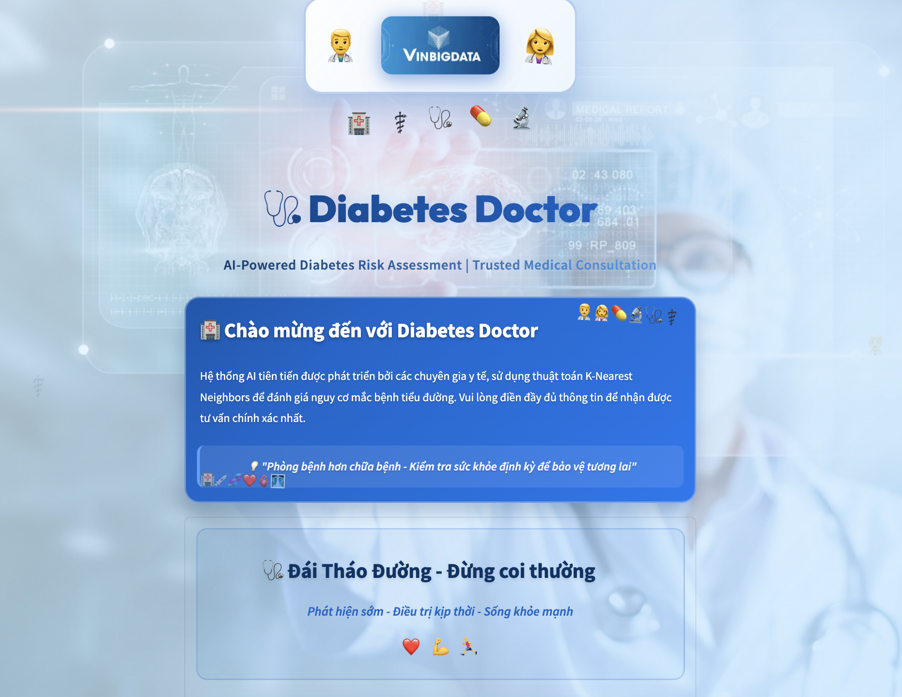

# Streamlined LLM-Based Application Development

A comprehensive platform featuring multiple AI applications and utilities for Large Language Model interactions. This repository serves as a centralized hub for various AI-powered tools and experiments.

## 🎯 Project Vision

This platform aims to become a comprehensive ecosystem of AI-powered applications, providing easy-to-use tools for experimenting with different Large Language Models and building innovative AI solutions.

## 📋 Applications Index

### 1. ChatLLM Playground 🤖


#### Description
An interactive web application for experimenting with various Large Language Models. Supports multiple providers (OpenAI GPT, Together AI) with real-time parameter control and modern chat interface.

#### Features
- 🔄 Multi-provider support (OpenAI & Together AI)
- 🎛️ Real-time parameter control (temperature, top-p)
- 💬 Modern chat interface with history
- 🎨 Animated background effects
- 📊 Model information and descriptions

#### Quick Start

1. **Install dependencies**
   ```bash
   pip install -r pages/requirements.txt
   ```

2. **Start server** 
   ```bash
   python ChatPlayground-Server.py
   ```

2. **Run the application**
   ```bash
   streamlit run pages/ChatPlayground.py
   ```


#### How to Use
1. Select model provider (OpenAI or Together AI) from sidebar
2. Choose your preferred model
3. Adjust temperature (creativity) and top-p (diversity) parameters
4. Start chatting in the main interface
5. Use 🗑️ button to clear chat history

---

### 2. Diabetes Doctor 🩺



#### Description
An intelligent medical assessment application for diabetes risk prediction using machine learning. Features a professional medical interface with KNN (K-Nearest Neighbors) algorithm for accurate risk assessment based on multiple health parameters.

#### Features
- 🤖 **AI-Powered Prediction**: Advanced KNN machine learning model for diabetes risk assessment
- 🏥 **Medical-Grade Interface**: Professional blue medical theme with animated elements
- 📊 **Comprehensive Assessment**: Multi-factor analysis including BMI, blood pressure, glucose levels
- 🎯 **Real-time BMI Calculation**: Automatic BMI computation and categorization
- 📈 **Interactive Visualizations**: Dynamic charts and health metrics display
- 🌟 **Motivational System**: Encouraging health quotes and professional guidance
- 🎨 **Animated UI**: Smooth transitions, gradient borders, and floating medical icons
- 🔒 **Privacy-Focused**: Secure health data processing with no data storage

#### Health Parameters Assessed
- **Demographics**: Age, gender
- **Physical Metrics**: Height, weight, BMI (auto-calculated)
- **Vital Signs**: Blood pressure (systolic/diastolic), heart rate
- **Blood Tests**: Glucose levels, HbA1c, cholesterol
- **Medical History**: Stroke history, family diabetes history
- **Lifestyle Factors**: Exercise habits, stress levels, sleep quality

#### Technical Architecture
- **Frontend**: Streamlit with custom CSS/HTML for medical UI
- **Backend**: Flask API server for model inference
- **ML Model**: Scikit-learn KNN classifier trained on diabetes dataset
- **Data Processing**: Pandas/NumPy for feature engineering
- **Model Persistence**: Joblib for model serialization

#### Quick Start

1. **Install dependencies**
   ```bash
   pip install streamlit flask scikit-learn pandas numpy joblib
   ```

2. **Start the Flask API server**
   ```bash
   python DiabeteDoctor-Server.py
   ```

3. **Run the Streamlit application**
   ```bash
   streamlit run pages/DiabeteDoctor.py
   ```

4. **Access the application**
   - Open your browser to `http://localhost:8501`
   - Ensure the API server is running on `http://localhost:5000`

#### How to Use
1. **Fill Health Assessment Form**: Complete all sections with your health information
2. **Automatic BMI Calculation**: Height and weight automatically calculate BMI
3. **Submit for Analysis**: Click "🔍 Phân tích nguy cơ tiểu đường" button
4. **View Results**: Review your diabetes risk assessment and recommendations
5. **Follow Guidance**: Read personalized health advice and next steps

#### Model Performance
- **Algorithm**: K-Nearest Neighbors (KNN)
- **Training Data**: Comprehensive diabetes dataset with multiple health indicators
- **Features**: 12+ health parameters for comprehensive assessment
- **Accuracy**: Optimized for medical-grade prediction reliability

#### Collaboration
This project is developed in collaboration between:
- **VinBig Data Science**: Advanced AI and machine learning expertise
- **Hanoi University of Science and Technology (HUST)**: Academic research and validation

#### Medical Disclaimer
⚠️ **Important**: This application is for educational and screening purposes only. Always consult qualified healthcare professionals for medical diagnosis and treatment decisions.


