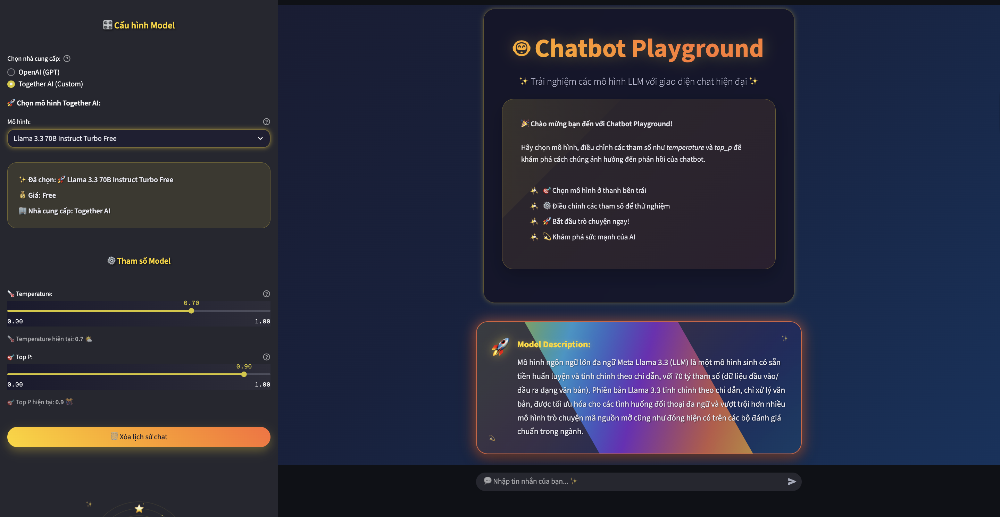

# Streamlined LLM-Based Application Development

A comprehensive platform featuring multiple AI applications and utilities for Large Language Model interactions. This repository serves as a centralized hub for various AI-powered tools and experiments.

## 🎯 Project Vision

This platform aims to become a comprehensive ecosystem of AI-powered applications, providing easy-to-use tools for experimenting with different Large Language Models and building innovative AI solutions.

## 📋 Applications Index

### 1. ChatLLM Playground 🤖



#### Description
An interactive web application for experimenting with various Large Language Models. Supports multiple providers (OpenAI GPT, Together AI) with real-time parameter control and modern chat interface.

#### Features
- 🔄 Multi-provider support (OpenAI & Together AI)
- 🎛️ Real-time parameter control (temperature, top-p)
- 💬 Modern chat interface with history
- 🎨 Animated background effects
- 📊 Model information and descriptions

#### Quick Start

1. **Install dependencies**
   ```bash
   pip install -r pages/requirements.txt
   ```

2. **Start server** 
   ```bash
   python ChatPlayground-Server.py
   ```

2. **Run the application**
   ```bash
   streamlit run pages/ChatPlayground.py
   ```


#### How to Use
1. Select model provider (OpenAI or Together AI) from sidebar
2. Choose your preferred model
3. Adjust temperature (creativity) and top-p (diversity) parameters
4. Start chatting in the main interface
5. Use 🗑️ button to clear chat history


